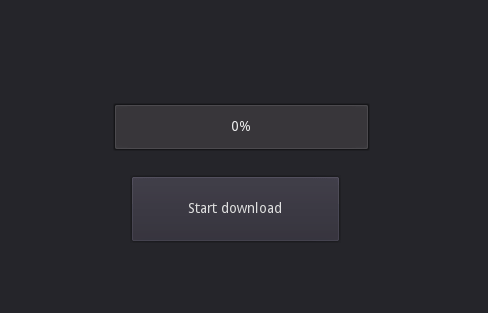

# Godot_File_Downloader
---



## What does this project do?
This project is a class for downloading files (through http) and supporting a progress bar.
There is sadly no built-in solution so I made this.

## Why is this project useful?
If you ever need to download files with Godot you will find out it requires
some work to make it nice and display a progress bar to your user.

Using this home made class will make it faster for you to create a downloader
in Godot.

## How to install?

1. Download the latest release
2. Copy the addons folder into your Godot project's folder
3. Enable the plugin in `Projet`, `Project settings`, `Plugins`.

## How to use?

### With little code

1. Add a new node to your scene
2. Search for FileDownloader (It is a child of HTTPRequest)
3. Add a FileDownloader node in your scene
4. Clic on node and edit its script variables directly in the editor.
`File Urls` and `Save_Path`
5. Now simply call `$FileDownloader.start_download()` somewhere in your script.

*You alternatively can replace the step 4 and 5 by code*

```
var urls       : PoolStringArray = ["url_to_file1","url_file_2"]
var path       : String          = "user://downloads"
$FileDownloader.start_download(urls, path)
```

### With code only

You might want to use code only if you use an autoload to manage the downloads.

```
var _downloader = FileDownloader.new()
var urls : PoolStringArray = ["url_to_file1","url_file_2"]
var path : String = "user://downloads"

add_child(_downloader) # It's REQUIRED to add the node to the scene tree because the download won't work otherwise
_downloader.start_download(urls, path)
```

## Demo

The release ships a demo project. Feel free to run it in Godot and explore it.

## Limitations

### Webp

Downloading Webp files doesn't work.

### godot < 3.4.3

If the file you are trying to download is above 2.1GB the addon will just say it is 2.1GB and fails downloading it past 2.1GB.
See issue: https://github.com/godotengine/godot/issues/56314

## More information:

[Code of conduct](https://github.com/Lyaaaaaaaaaaaaaaa/Godot_File_Downloader/blob/master/CODE_OF_CONDUCT.md)

[How to contribute](https://github.com/Lyaaaaaaaaaaaaaaa/Godot_File_Downloader/blob/master/CONTRIBUTING.md)

